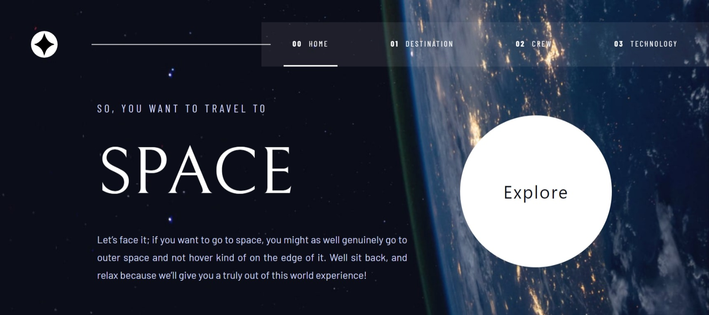

# Frontend Mentor - Space tourism website solution

This is a solution to the [Space tourism website challenge on Frontend Mentor](https://www.frontendmentor.io/challenges/space-tourism-multipage-website-gRWj1URZ3). Frontend Mentor challenges help you improve your coding skills by building realistic projects.

## Table of contents

- [Overview](#overview)
  - [The challenge](#the-challenge)
  - [Screenshot](#screenshot)
  - [Links](#links)
- [My process](#my-process)
  - [Built with](#built-with)
  - [Useful resources](#useful-resources)
- [Author](#author)

## Overview

### The challenge

Users should be able to:

- View the optimal layout for each of the website's pages depending on their device's screen size
- See hover states for all interactive elements on the page
- View each page and be able to toggle between the tabs to see new information

### Screenshot

### Links

- Solution URL: [Solution URL here](https://www.frontendmentor.io/solutions/space-tourism-using-nextjs-and-tailwindcss-ibCwPd54Vs)
- Live Site URL: [Live site URL here](https://space-tourship.netlify.app/)

## My process

### Built with

- Semantic HTML5 markup
- CSS custom properties
- Flexbox
- Mobile-first workflow
- [React](https://reactjs.org/) - JS library
- [Next.js](https://nextjs.org/) - React framework
- [Tailwindcss](https://tailwindcss.com/) - For styles

### Useful resources

- [Developer Mozilla](https://developer.mozilla.org/en-US/) - This helped me to learn about css and responsive design.
- [CSS Tricks](https://css-tricks.com/) - This helps me understand more about css tricks. It has great explanations with examples that make it easy to understand.
- [Web Dev](https://web.dev/learn/css/animations/) - This helps me learn about animation css such as button pulse animation that I used in this project.

## Author

- Website - [Yulinda](https://space-tourship.netlify.app/)
- Frontend Mentor - [@yulindaramadhana](https://www.frontendmentor.io/profile/yulindaramadhana)
